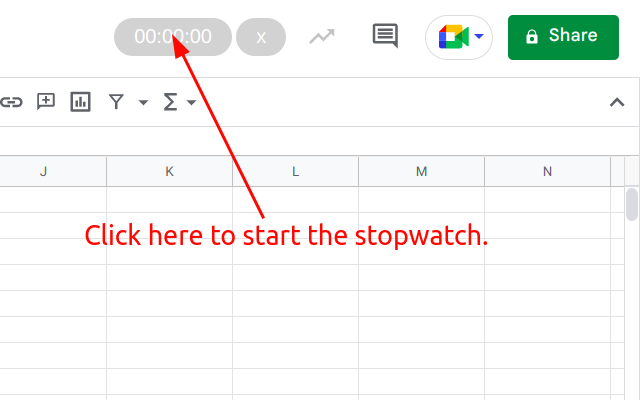
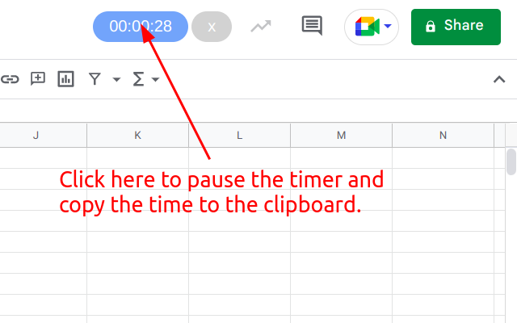
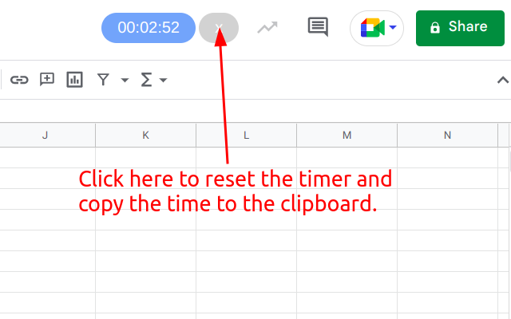

# google-sheets-timer

This extension adds a stopwatch to Google Sheets. When the stopwatch isn't running you can start the stopwatch by clicking on the time. When the stopwatch is running you can click on the time again to pause the stopwatch. The stopwatch can be reset anytime by clicking on the X button next to the time.

When the stopwatch is paused or reset the time is copied to the clipboard.

[This extension can be installed from the Chrome Web Store](https://chrome.google.com/webstore/detail/dldgbenmbgcinedpcmkllgabdmihabon?authuser=2&hl=en)

---

---

---

---